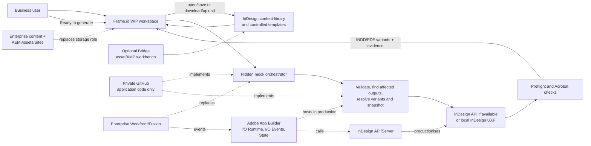

# Adobe-based Keystone alternative: prototype architecture, storyboard and build plan

**Date:** 17 September 2026

## Purpose

Build and record a working, personal-account prototype of an Adobe-based alternative to Objective Keystone. A business user should update reusable content and a visual template through Adobe interfaces, request generation, and see affected form/guide variants returned to the same workspace. The prototype uses Frame.io for visible WIP storage, InDesign for business editing and deterministic composition, Acrobat for output verification, and a hidden local application for mock Workfront orchestration plus reusable integration logic. The three sample documents will be selected later.

## Architecture



## What the proof must show

| Keystone-like capability | Prototype proof |
| --- | --- |
| Structured, reusable content | One business-readable InDesign library holds tagged reusable stories; structured data and a generated component register sit beside it in Frame.io. |
| Cascading change | Saving one shared component and selecting `Ready to generate` causes every affected document/variant to rebuild. |
| Templates, branding and variants | InDesign templates control layout; brand packs select logos, colours, styles, mandatory clauses and data without copying source content. |
| Collaborative authoring | Frame.io centralises versions/review; InDesign and Acrobat provide invited editing or shared review. No second user is staged. |
| Fillable output | A form template exports semantically named fields to an interactive PDF that passes an Acrobat check. |
| Closed storage loop | The user starts in Frame.io and finds generated INDD/PDF variants and evidence back there after generation. |

## Requirements boundary

| Requirement group | Prototype boundary |
| --- | --- |
| `REG-01`, `REG-02` | Prove two synthetic brands and three archetypes: fillable form, short guide/flyer and long document. Full brand/document breadth is deferred. |
| `REG-03`, `REG-06`, `REG-07` | Prove one centrally managed content/data change, where-used impact and deterministic propagation. |
| `REG-04`, `REG-05`, `REG-08`, `REG-09` | Prove controlled template change, approved-style templates, two brand variants and reduced repetitive InDesign work. |
| `REG-10`, `REG-11`, `REG-12`, `REG-16` | Frame.io versions, job/release evidence and human gates demonstrate the pattern only. Workfront remains the enterprise workflow, approval and audit authority. |
| `REG-13`, `REG-14` | Produce print and interactive PDF; represent the future AEM Sites hand-off in the release manifest rather than publishing a website. |
| `REG-15` | Preserve an explicit specialist InDesign exception path. |

## Application roles

- **Frame.io:** visible start/end for source packages, templates, WIP assets, statuses, generated variants and review. The free plan advertises two members, 2 GB storage and two projects; verify trial features before relying on them. Use a `Ready to generate` metadata value or folder move, and explicit download/upload if Mounted Storage is unreliable.
- **InDesign:** business-facing editor for tagged reusable stories and controlled templates; deterministic engine for layout, data placement, variants and PDF form controls.
- **Acrobat Pro:** verify form fields, tab order, save/reopen, links, tags and accessibility; apply only documented finishing rules that InDesign cannot emit.
- **Bridge:** optional local asset/XMP workbench. It need not appear if Frame.io provides the stronger storage story.
- **Local application, role 1 - mock orchestration:** poll Frame.io, set `Generating`/`Ready for review`/`Failed`, select affected outputs and invoke the build. This disposable adapter stands in for Workfront/Fusion.
- **Local application, role 2 - integration/composition:** validate sources; build the component dependency graph; resolve data, conditions and brand variants; call the InDesign API or local UXP adapter; run preflight; create release evidence; and return outputs to Frame.io. Keep `StorageAdapter`, `OrchestrationAdapter` and `CompositionAdapter` replaceable for production.
- **GitHub:** private repository for application code, schemas and synthetic tests only. It is neither the content store nor a demo screen.
- **Enterprise equivalent:** Workfront/Fusion replaces mock orchestration; governed content/AEM Assets replaces Frame.io's source/release role; InDesign API or Server replaces local desktop execution where justified. Adobe App Builder hosts both local application roles as serverless actions, started by Workfront events and calling the InDesign API; the assessment is in [adobe-prototype-demo-overview.md](adobe-prototype-demo-overview.md).
- **Frame.io API:** use Adobe IMS user OAuth through an Adobe Developer Console project. The live V4 API exposes non-deprecated webhooks, custom actions and version-stack creation, but the MVP should poll status/folders and use unique release IDs because those features are unnecessary for the proof.

## Storyboard

> **Updated 21 September 2026:** the recording steps that match the finished build are in [adobe-prototype-demo-runsheet.md](adobe-prototype-demo-runsheet.md). The outline below is the original intent.

1. **Open Frame.io.** Show `Source content`, `Templates and assets`, `Generated variants` and `Review and approved`, plus lifecycle status/Collections.
2. **Edit shared content.** Open `content-library.indd`, update one clearly labelled reusable story, and save/upload a new version. Stable tags such as `content:privacy.notice` drive reuse; the user never edits JSON/XML.
3. **Edit presentation.** Change one template swatch/style or centrally referenced logo and save a new template version. Template objects use bindings such as `content:privacy.notice`, `data:contact.phone` and `asset:brand.logo`; do not touch output files.
4. **Request generation.** Set the source/template to `Ready to generate`, or move it into that folder. Explain that Workfront would provide this event in production.
5. **Call out the hidden layer.** Show the architecture for 15-20 seconds only. The application resolves where-used dependencies, data, conditions and brand variants, then populates labelled InDesign objects and exports affected outputs.
6. **Show progress and results.** Refresh Frame.io from `Generating` to `Ready for review`; open the generated form, short guide and long guide across two brands and point to the propagated content/visual change.
7. **Verify and review.** Use Frame.io's multi-page INDD/PDF preview; use Acrobat to tab through the form, enter synthetic values, save/reopen and inspect links/tags. Collaboration is mentioned through Frame.io review, InDesign Invite to Edit/Share for Review and Acrobat shared review, not enacted.
8. **Close the loop.** Show a human-readable release manifest with source/template versions, affected outputs, build result and hashes, then map Frame.io to Workfront/AEM and local UXP to the production composition service.

Keep roughly 80% of a six-to-eight-minute recording in Frame.io, InDesign and Acrobat. Pre-seed the before state; do not show GitHub, code, terminals, a developer dashboard or a second user.

## Prototype storage model

```text
Frame.io project/
  01 Source content/
    content-library.indd       # tagged reusable stories
    product-data.csv
    component-register.json    # generated sidecar
  02 Templates and assets/
    templates/{form,short-guide,long-guide}.indt
    brands/{brand-a,brand-b}/
    assets/ and document-manifests/
  03 Generated variants/<release-id>/<brand>/
    *.indd, *.pdf, release-manifest.json
  04 Review and approved/

Private GitHub repository/
  src/domain/                  # validation, dependencies, variants
  src/adapters/{frameio,indesign-api}/
  src/orchestration/demo/      # disposable Workfront simulator
  indesign/uxp/                # local fallback/helpers
  schemas/, tests/, fixtures/  # synthetic content only
```

- Reusable stories have stable IDs plus owner/status/effective dates in the generated sidecar.
- Data values are typed and carry source, effective dates and verification status.
- Document manifests identify template, ordered components, data/asset bindings, conditions, brands and outputs.
- Release manifests record Frame.io source versions, template/asset hashes, resolved inputs, application version, output hashes and validation result.

## Phased build plan

### Phase 0: technical spikes

- Verify Frame.io trial features, OAuth file/status operations, multi-page INDD preview and Mounted Storage; fall back to folders and explicit download/upload.
- Verify InDesign API entitlement. If unavailable, use local UXP and retain the API as the production mapping.
- Prove UXP can read a resolved bundle, populate labelled objects, export PDF and return machine-readable preflight/overset failures.
- Prove text, radio and checkbox fields survive export and work in Acrobat.

### Phase 1: hidden application and contracts

- Create the private GitHub repository; exclude credentials, tokens, business source packages, outputs and caches.
- Define schemas and the three adapters; implement Frame.io polling/file transfer/status plus dependency and affected-output selection.
- Extract tagged stories into an intermediate model for headings, paragraphs, lists, links, tables and footnotes; resolve data, conditions and variants before composition.

### Phase 2: one business-facing vertical slice

- Put one synthetic component, data value, asset and template in Frame.io and complete the visible edit-to-return loop.
- Map semantic content to named InDesign styles; create a deterministic snapshot and upload the tagged PDF plus release manifest.
- Fail on unresolved, duplicate or unapproved references, missing assets/fonts, overset text or preflight errors.

### Phase 3: three archetypes and variants

- Select the three representative PDFs and inventory components, data, assets, layout rules and form controls.
- Create separate templates/manifests for the form, short guide and long guide; PDFs are visual references, not authoring sources.
- Add two brand packs, one component used by all documents, one data value used by two, and semantic form fields/tooltips/tab order.

### Phase 4: storyboard polish and evidence

- Configure Frame.io views and add a human-readable where-used/release report to each release.
- Seed the before state and rehearse the eight-scene recording; capture timings as prototype observations only.

## Acceptance tests

- A business user completes the visible flow using Frame.io, InDesign and Acrobat without seeing GitHub, source code, a terminal or a developer dashboard.
- One shared change updates all three affected documents; one data change updates every binding; unaffected documents are not rebuilt.
- At least two brand variants render from shared content without copied source blocks.
- Invalid/unapproved inputs, missing assets/fonts, overset text and failed preflight cause a visible hard failure.
- The fillable PDF exposes unique semantic field names, logical tab order and successful save/reopen behaviour.
- Every output returns to Frame.io with a manifest identifying source/template versions, inputs, hashes and build result.
- A specialist can create a controlled template exception without changing canonical shared content.
- The application can replace its Frame.io orchestration adapter without changing dependency, variant or composition logic.

## Important design boundaries

- **Frame.io is file-level WIP storage, not a CCMS, DAM or regulatory approval system.** Production equivalents are governed content, Workfront and AEM.
- **Use one editable source.** If InDesign cloud documents provide Invite to Edit, Frame.io holds snapshots/previews; do not maintain two masters.
- **Bridge is optional and local.** It adds no central governance beyond Frame.io and need not appear in the recording.
- **Data Merge is an adjunct.** Use it for row-based records only; dependency, clause and long-document logic belongs in the application/UXP layer.
- **Desktop InDesign is not unattended production infrastructure.** Enterprise operation requires an entitled InDesign API/Server path and support design.
- Frame.io review, InDesign Invite to Edit/Share for Review and Acrobat shared review evidence collaboration, but not simultaneous co-authoring or segregation of duties.
- The proof does not establish enterprise scale, availability/DR, immutable audit/retention, AEM/Workfront integration, browser authoring or PDF/UA conformance.
- Trial access to Frame.io API, metadata and Mounted Storage, plus InDesign API entitlement, must be verified in Phase 0.
- Use only public or synthetic content/assets in personal Frame.io, Creative Cloud and GitHub accounts; never store credentials or internal/customer data there.

## Decision after the prototype

- Retain Frame.io if its trial supports the edit/version/status/API-return loop; otherwise swap in one InDesign cloud source plus local release storage without changing the core adapters.
- Proceed to an enterprise proof if business editing, where-used analysis, deterministic variants and template effort are acceptable.
- Narrow the solution to templated composition if maintaining the tagged content library is too technical for business authors.
- Reconsider a Keystone-class CCMS if browser authoring, granular verification/reverification or formal content-level evidence is essential.

## Sources

- [CSC Use Case Catalogue](https://ifl.atlassian.net/wiki/spaces/~71202045515c5f2865495eb38779dc8d8457d0/pages/1530299247/CSC+Use+Case+Catalogue), version 1, retrieved 17 September 2026.
- [CSC Requirements Documentation Workshop Readout](https://ifl.atlassian.net/wiki/spaces/AACC/pages/1525089284/CSC+Requirements+Documentation+Workshop+Readout), version 5, retrieved 17 September 2026.
- [Adobe Bridge product](https://www.adobe.com/products/bridge.html) and [metadata](https://helpx.adobe.com/bridge/using/metadata-adobe-bridge.html).
- [Frame.io plans and pricing](https://frame.io/pricing), including free/trial storage and project limits.
- [Frame.io file management](https://frame.io/features/file-management) and [workflow metadata](https://frame.io/features/workflow-management).
- [Frame.io multi-page InDesign previews](https://blog.frame.io/2026/09/08/new-in-frame-io-indesign-previews-spacebar-quicklook-and-ibc-2026/), available on all plans as of 8 September 2026.
- [Frame.io V4 API getting started](https://next.developer.frame.io/platform/v4/docs/getting-started) and [authentication](https://next.developer.frame.io/platform/v4/docs/guides/authentication/overview).
- [Adobe InDesign Data Merge](https://helpx.adobe.com/indesign/using/data-merge.html).
- [Adobe InDesign UXP scripts/plugins](https://developer.adobe.com/indesign/uxp/) and [DOM](https://developer.adobe.com/indesign/uxp/dom/api/).
- [InDesign Invite to Edit](https://helpx.adobe.com/indesign/using/invite-to-edit.html), [Share for Review](https://helpx.adobe.com/indesign/using/share-for-review.html) and [cloud documents](https://helpx.adobe.com/indesign/using/cloud-documents.html).
- [Acrobat shared PDF review](https://helpx.adobe.com/acrobat/using/sharing-pdfs.html).
